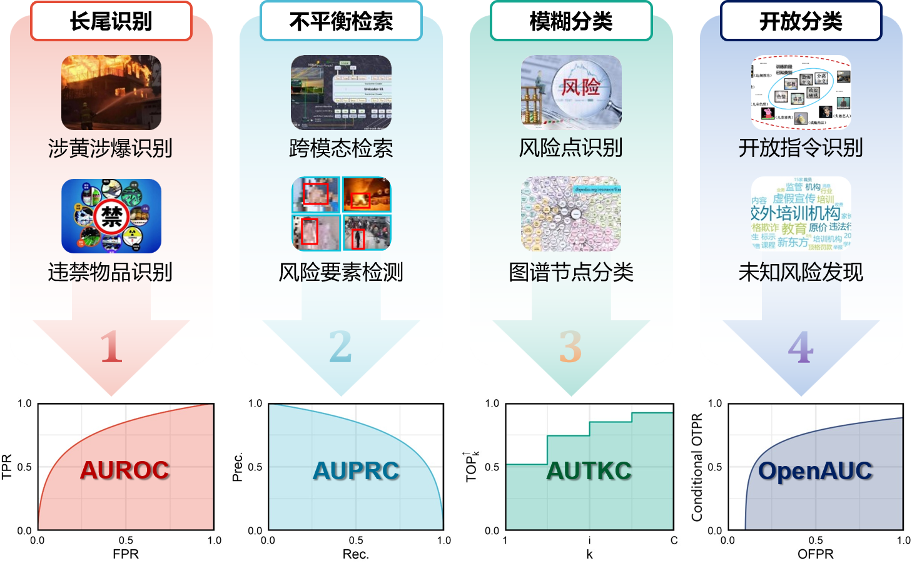

爬虫：三个 俊宇

跨模态知识图谱嵌入/推理：宗胜

跨媒体推荐：曹天伟、俊宇

XCurve: 

	- AUPRC 佩松

	- AUTKC、OpenAUC 子泰
  
	- GraphAUC 俊宇
  
	- PartialAUC 慧杨、世龙
	 
	- AUCAT 文政
	
    - MAUC 世龙、培峰

    - TPR@FPR 佩松
	
昀睿 CVPR

姜璇 IJCAI

...

